# Better BooThang

Have you ever forgotten to send a text? Did you ever leave someone on read, but this time, you didn't mean to? With Better BooThang you won't have to worry about those confrontational texts! Better BooThang is an automated messaging app that sends your loved ones texts messages even when you've forgotten to. Choose a pre-made text for every occasion!

With Better BooThang all you have to do is automate your way into their heart!

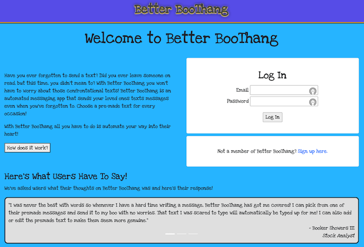

## How Better BooThang Works

Better BooThang is an app that uses timers, pre-made texts, and basic info about your loved ones to send them that loving notification when you want. If you're brand new to the app, here's the quick run through.

Firstly, you would want to make an account with us. Before we can send anything to your boo we need to know about you!

Once we know you, tell us about your boo! We don't need anything too personal, just the simple things like their:

- **Name**
- **Phone Number**

Set your message! Did you need to send a message about an anniversary? Did you almost forget about their birthday? Did you need to text them _every_ day? Better BooThang has pre-made messages for every occasion! So if you're hitting a writer's block for your sentimental message, or you can't find the right words to write, Better BooThang has got you covered!

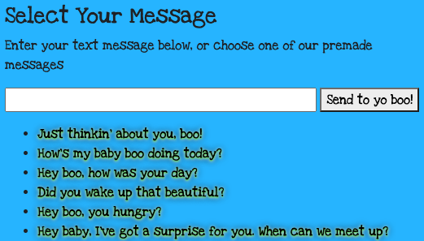

Finally, send it and forget it!

## Motivation

With Project 2 being a team project, we all wanted to have some light hearted fun. We went through many different ideas, but ultimately settled on an idea from our instructor James. We instantly liked how silly the app seemed and we were adding features to the pitch. The next thing we knew, we had thought out ideas for a working product, wireframes, and extra features to give the app more quirkiness.

## User Stories

- As a user, I want to be able to input info about my BooThang.
- As a user, I want to be able to read info about my BooThang.
- As a user, I want to be able to update info about my BooThang.
- As a user, I want to be able to delete my BooThang.
- As a user, I want to enable sending messages to my selected BooThang.
- As a user, I want to select a pre-made message and send it to my selected BooThang.

## Entity Relationship Diagram

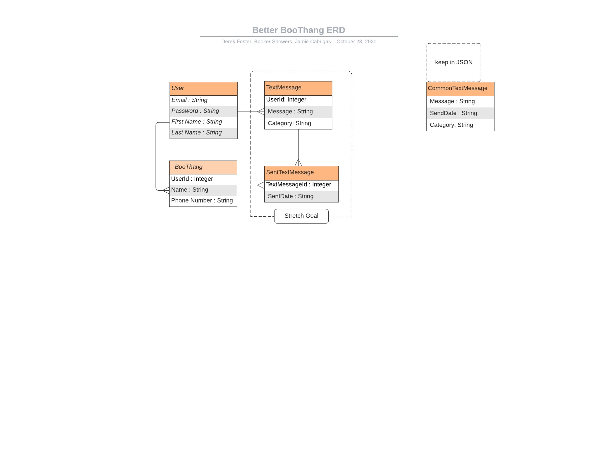

## Wireframing/Pre-Coding Planning

The team had created a wireframe to help visualize what the app would look like for the user. We also made sure to have a page flow planned out so the team knew what pages could be accessed when a user was logged in and what pages would be inaccessible if a user were not logged into their profile.

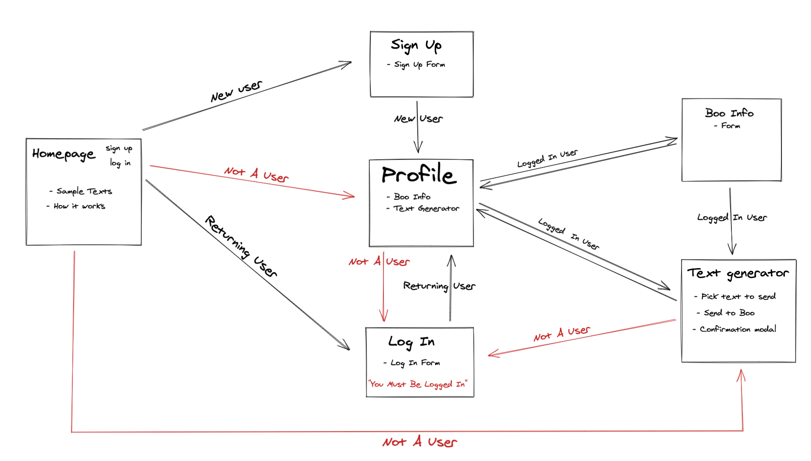
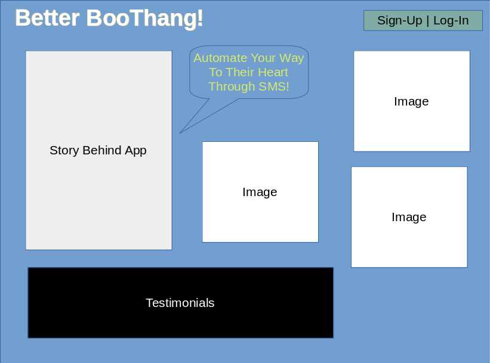
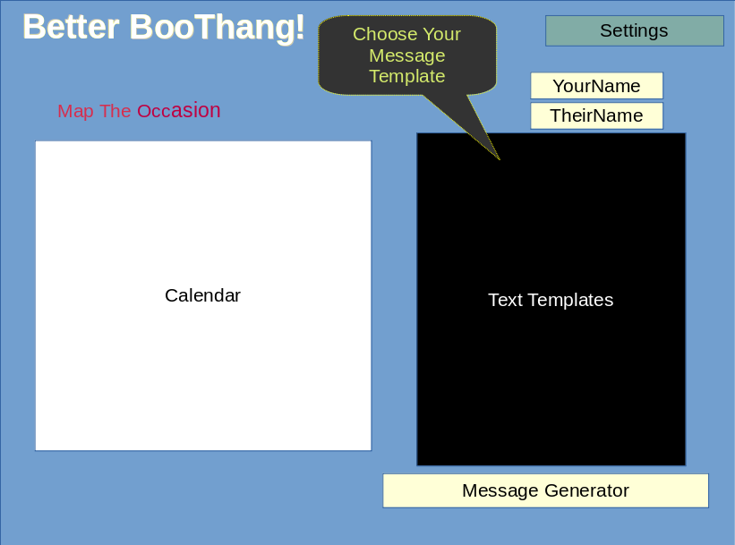

## Code Snipets

For this website we used many different types of software for front-end, back-end, and anything in between to be able to achieve what we can show you today. Here's a list of some of the modules and technology.

- Express
- Passport
- Sequelize
- Bootstrap
- JSON
- Twilio
- Fetch API

Here's some code that we're proud to present to you!

This code shows how it accesses our messages if a user chooses one of our premade messages.

This code shows how one of the modals work.

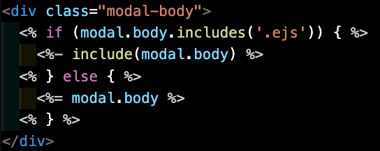

This is one part of code to delete and update BooThangs.
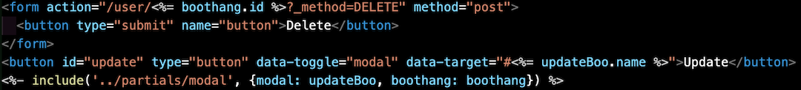

This is the code showing the route for updating your Boo in the database.

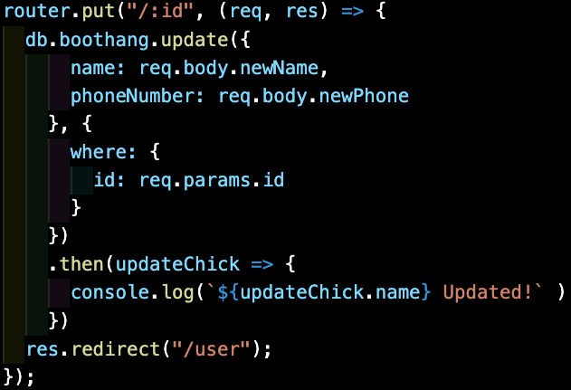

This is the code to access Twilio to send messages to phone devices!

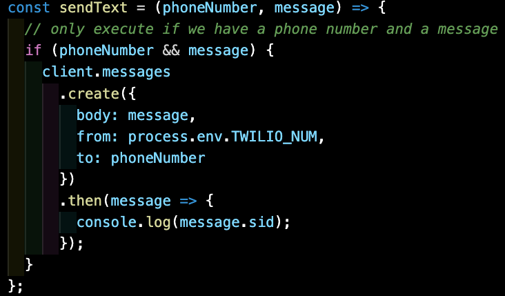

This is how the carousel works!

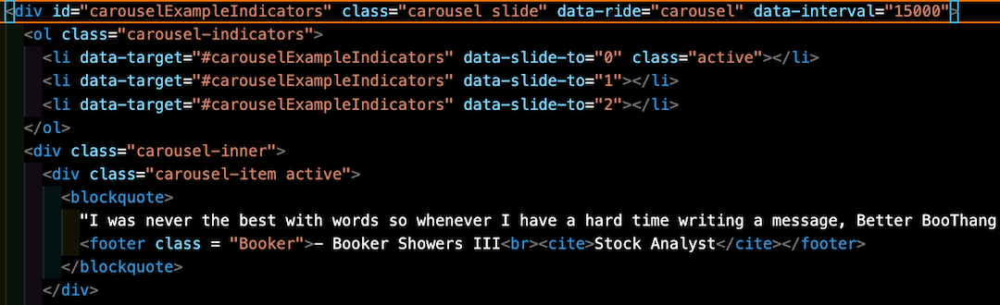

## Note

Please ensure that the following environment variables are set before the application is run

- SESSION_SECRET
- AUTH_TOKEN
- ACCOUNT_SID
- TWILIO_NUM
- A database named "better-boothang" to migrate models

## Future Development

We originally had plans for this project that we ultimately had to cut out in order to achieve a working product by our deadline. In the future we would like to add many features to our base version.

- As a user, I want to be able to select a date and time for the message to be sent to my selected BooThang.
- As a user, I want to be able to upload photos for each boo.
- As a user, I want to have multiple different categories of texts to choose from.
- Update styling (list elements for premade messages)
