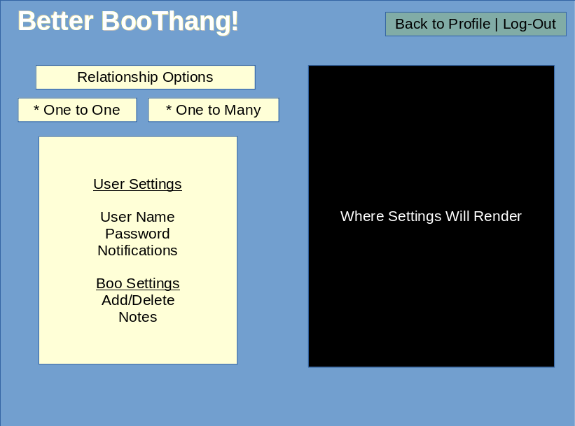

# Better BooThang
Have you ever forgotten to send a text? Did you ever leave someone on read, but this time, you didn't mean to? With Better BooThang you won't have to worry about those confrontational texts! Better BooThang is an automated messaging app that sends your loved ones texts messages even when you've forgotten to. Choose a pre-made text for every occasion!

<!-- Commented out for Feasibilty Check -->
<!-- - Birthdays
- Anniversaries
- Holidays
- Everyday
- And so many more! -->

With Better BooThang all you have to do is automate your way into their heart!

## How Better BooThang Works
Better BooThang is an app that uses timers, pre-made texts, and basic info about your loved ones to send them that loving notification when you want. If you're brand new to the app, here's the quick run through.

Firstly, you would want to make an account with us. Before we can send anything to your boo we need to know about you!

Once we know you, tell us about your boo! We don't need anything too personal, just the simple things like their 
- **Name**
- **Phone Number**
<!-- Commented Out until we reach a soft MVP -->
<!-- - Birthday
- The day you two said "okay" to dating each other -->

Set your message! Did you need to send a message about an anniversary? Did you almost forget about their birthday? Did you need to text them *every* day? Better BooThang has pre-made messages for every occasion! So if you're hitting a writer's block for your sentimental message, or you can't find the right words to write, Better BooThang has got you covered!

Next, pick *when* you want to send your messages! Our app allows you to choose the right time for you. Noon? 5pm? Midnight? Set it and forget it!
<!-- Save specificity for AFTER MVP (Feasibility Check) -->
<!-- - A specific date of the year
- A special day of the month
- A certain day of the week
- Every single day. -->

## Motivation
With Project 2 being a team project, we all wanted to have some light hearted fun. We went through many different ideas, but ultimately settled on an idea from our instructor James. We instantly liked how silly the app seemed and we were adding features to the pitch. The next thing we knew, we had thought out ideas for a working product, wireframes, and extra features to give the app more quirkiness.

## User Stories
- As a user, I want to be able to input info about my BooThang.
- As a user, I want to be able to read info about my BooThang.
- As a user, I want to be able to update info about my BooThang.
- As a user, I want to be able to delete my BooThang.
- As a user, I want to enable sending messages to my selected BooThang.
- As a user, I want to select a pre-made message and send it to my selected BooThang.

## Wireframing/Pre-Coding Planning
The team had created a wireframe to help visualize what the app would look like for the user. We also made sure to have a page flow planned out so the team knew what pages could be accessed when a user was logged in and what pages would be inaccessible if a user were not logged into their profile.

## Code Snipets
For this website we used many different types of software for front-end, back-end, and anything in between to be able to achieve what we can show you today. Here's a list of some of the software.
- Express
- Passport
- Sequelize
- Bootstrap
- JSON

Here's some code that we're proud to present to you!

## Future Development
As a user, I want to be able to select a date and time for the message to be sent to my selected BooThang.